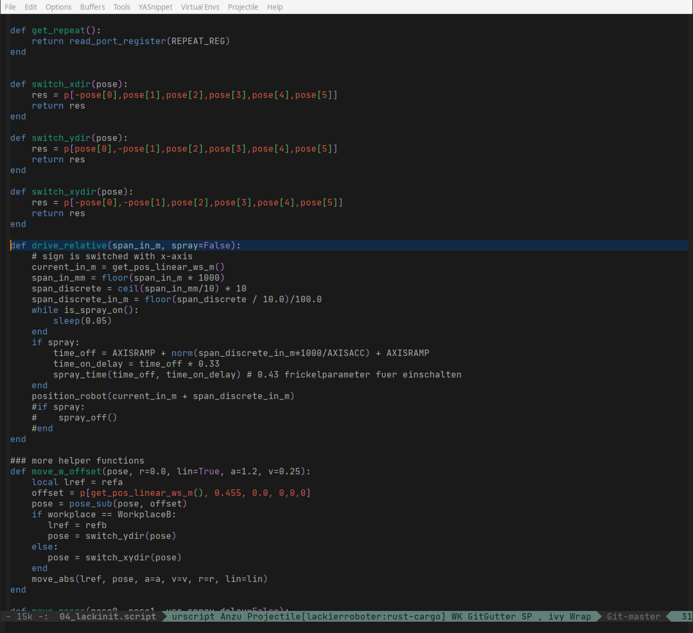

# URScript Major Mode for Emacs

Programming URscript for Universal Robots (https://www.universal-robots.com) within your favorite editor Emacs.

urscript-mode is built as a derived mode from prog-mode.

It features keywords, function highlighting, built-in-functions.

## Screenshots

## Installation

(load-file "~/path/to/urscript-mode.el")
(require 'urscript-mode)
(add-to-list 'auto-mode-alist '("\\.script\\'" . urscript-mode))
